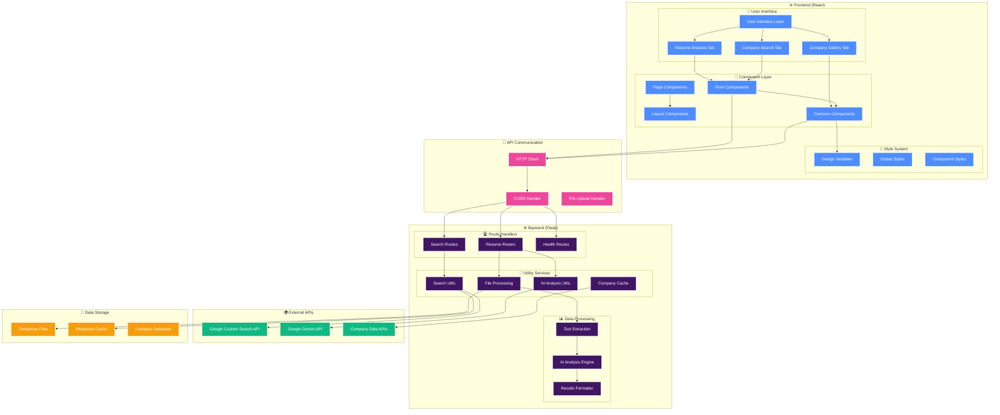

# 🔍 LinkedIn Recruiter Finder

A full-stack web application that helps you find LinkedIn recruiter profiles using two powerful methods: search by company name or get AI-powered recommendations based on your resume analysis.

## ✨ Features

### 🏢 **Company Search**

- **Official Google APIs**: Uses Google Custom Search API for reliable results
- **Smart Search**: Automatically searches for various recruiter titles and roles
- **Real-time Results**: Get up to 10 LinkedIn profiles with titles and snippets

### 📄 **Resume Analysis** (NEW!)

- **AI-Powered Analysis**: Uses Gemini 2.0 Flash to analyze your resume
- **Skills Extraction**: Automatically identifies technical skills, experience level, and industry focus
- **Smart Matching**: Recommends recruiters based on your profile analysis
- **Match Scoring**: Shows percentage match and reasoning for each recruiter recommendation
- **File Support**: Supports PDF, DOC, DOCX, and TXT resume formats

### 🌟 **Common Features**

- **Responsive Design**: Clean, modern UI that works on desktop and mobile
- **Error Handling**: Graceful error handling with helpful user feedback
- **Loading States**: Visual feedback during searches and analysis
- **No Authentication**: Runs completely locally without any signup required

## 🛠 Tech Stack

**Backend:**

- Python 3.8+
- Flask (Web framework)
- Google Custom Search API
- Google Gemini 2.0 Flash API
- PyPDF2 (PDF text extraction)
- python-docx (Word document processing)
- Flask-CORS (Cross-origin requests)

**Frontend:**

- React 18
- CSS3 with responsive design
- Modern ES6+ JavaScript

## 📋 Prerequisites

- **Python 3.8 or higher**
- **Node.js 16 or higher**
- **npm or yarn**
- **Google Cloud Account** with APIs enabled

## 🚀 Quick Start

### 1. Set Up Google Cloud APIs

#### Enable Required APIs:

1. Go to [Google Cloud Console](https://console.cloud.google.com/)
2. Create a new project or select existing one
3. Enable these APIs:
   - **Custom Search API**: https://console.cloud.google.com/apis/library/customsearch.googleapis.com
   - **Gemini API**: https://console.cloud.google.com/apis/library/generativelanguage.googleapis.com

#### Create API Keys:

1. **Custom Search API Key**:

   - Go to [Credentials](https://console.cloud.google.com/apis/credentials)
   - Click "Create Credentials" → "API Key"
   - Copy the API key

2. **Custom Search Engine ID**:

   - Go to [Custom Search Engine](https://cse.google.com/cse/)
   - Click "Add" to create a new search engine
   - Set "Sites to search" to: `linkedin.com/in/*`
   - Copy the Search Engine ID (cx)

3. **Gemini API Key**:
   - Go to [AI Studio](https://makersuite.google.com/app/apikey)
   - Create a new API key
   - Copy the API key

### 2. Set Environment Variables

```bash
# Set these environment variables before running the app
export GOOGLE_CUSTOM_SEARCH_API_KEY="your_custom_search_api_key"
export GOOGLE_CUSTOM_SEARCH_ENGINE_ID="your_search_engine_id"
export GOOGLE_GEMINI_API_KEY="your_gemini_api_key"
```

### 3. Backend Setup

```bash
# Install Python dependencies
pip install -r requirements.txt

# Start the backend server
python app.py
```

The backend will start on `http://localhost:5000`

### 4. Frontend Setup

Open a new terminal window and navigate to the frontend directory:

```bash
# Navigate to frontend directory
cd frontend

# Install Node.js dependencies
npm install

# Start the React development server
npm start
```

The frontend will start on `http://localhost:3000` and automatically open in your browser.

## 🎯 How to Use

### 🏢 Company Search Mode

1. **Select "Search by Company" tab**
2. **Enter a company name** in the search box (e.g., "Google", "Microsoft", "Apple")
3. **Click Search** and wait for results
4. **View the results** - click on any profile link to open it in a new tab

### 📄 Resume Analysis Mode

1. **Select "Resume Analysis" tab**
2. **Upload your resume** (PDF, DOC, DOCX, or TXT format, max 5MB)
3. **Wait for AI analysis** - Gemini will extract skills, experience level, and industry focus
4. **View recommendations** - See recruiter profiles matched to your background with match scores
5. **Contact recruiters** - Click profile links to connect on LinkedIn

### Example Companies to Try:

- Google, Microsoft, Apple, Amazon, Meta, Netflix, Tesla, Adobe

## 📁 Project Structure

```
linkedin-recruiter-finder/
├── app.py                 # Flask backend application
├── requirements.txt       # Python dependencies
├── README.md             # This file
├── routes/               # API route handlers
│   ├── search_routes.py  # Company search endpoints
│   ├── resume_routes.py  # Resume analysis endpoints
│   └── health_routes.py  # Health check endpoints
├── utils/                # Utility modules
│   ├── gemini_utils.py   # AI analysis functions
│   ├── search_utils.py   # Search logic
│   └── file_utils.py     # File processing
└── frontend/
    ├── package.json      # Node.js dependencies
    ├── public/
    │   └── index.html    # HTML template
    └── src/
        ├── index.js      # React entry point
        ├── App.js        # Main React component
        ├── styles/       # Organized CSS architecture
        │   ├── variables.css  # Design system
        │   ├── base.css      # Global styles
        │   └── App.css       # Utilities
        └── components/   # React components
            ├── layout/   # Layout components
            ├── pages/    # Page components
            ├── common/   # Shared components
            └── forms/    # Form components
```

## 🏗️ Application Architecture



## 🔄 Application State Flow

```mermaid
stateDiagram-v2
    [*] --> AppInitialization

    state "Application Startup" as AppInitialization {
        [*] --> LoadingAssets
        LoadingAssets --> InitializeRouting
        InitializeRouting --> SetupAPIClient
        SetupAPIClient --> RenderLayout
        RenderLayout --> Ready
    }

    AppInitialization --> NavigationState

    state "Navigation & Routing" as NavigationState {
        [*] --> TabSelection

        state TabSelection <<choice>>
        TabSelection --> ResumeAnalysisFlow : Resume Tab
        TabSelection --> CompanySearchFlow : Search Tab
        TabSelection --> CompanyGalleryFlow : Gallery Tab

        state "Resume Analysis Workflow" as ResumeAnalysisFlow {
            [*] --> FileUploadIdle
            FileUploadIdle --> FileSelected : User selects file
            FileSelected --> FileValidation

            state FileValidation <<choice>>
            FileValidation --> FileUploadProgress : Valid file
            FileValidation --> FileUploadError : Invalid file

            FileUploadProgress --> AIAnalysisInProgress
            AIAnalysisInProgress --> AnalysisComplete : Success
            AIAnalysisInProgress --> AnalysisError : AI Error

            AnalysisComplete --> DisplayResults
            DisplayResults --> ShowRecommendations
            ShowRecommendations --> RecruiterContact : User clicks profile

            FileUploadError --> FileUploadIdle : User fixes/retries
            AnalysisError --> FileUploadIdle : User retries
            RecruiterContact --> [*] : External navigation
        }

        state "Company Search Workflow" as CompanySearchFlow {
            [*] --> SearchFormIdle
            SearchFormIdle --> SearchInputActive : User types
            SearchInputActive --> SearchValidation

            state SearchValidation <<choice>>
            SearchValidation --> SearchExecuting : Valid input
            SearchValidation --> SearchFormError : Invalid input

            SearchExecuting --> SearchInProgress
            SearchInProgress --> SearchResultsFound : Results available
            SearchInProgress --> NoSearchResults : No results
            SearchInProgress --> SearchAPIError : API error

            SearchResultsFound --> DisplaySearchResults
            DisplaySearchResults --> RecruiterProfileView : User clicks profile

            NoSearchResults --> SearchSuggestions
            SearchSuggestions --> SearchFormIdle : User tries again

            SearchAPIError --> SearchErrorDisplay
            SearchErrorDisplay --> SearchFormIdle : User retries

            SearchFormError --> SearchFormIdle : User corrects input
            RecruiterProfileView --> [*] : External navigation
        }

        state "Company Gallery Workflow" as CompanyGalleryFlow {
            [*] --> GalleryLoading
            GalleryLoading --> CompaniesLoaded : Data fetched
            GalleryLoading --> GalleryLoadError : Load failed

            CompaniesLoaded --> GalleryIdle
            GalleryIdle --> FilteringActive : User applies filters
            GalleryIdle --> CompanyInteraction : User interacts with card

            state FilteringActive {
                [*] --> LocationFiltering
                LocationFiltering --> SearchFiltering : Additional filter
                SearchFiltering --> CategoryFiltering : Additional filter
                CategoryFiltering --> FilterResults
                FilterResults --> FilteredView
                FilteredView --> ClearFilters : User clears
                ClearFilters --> [*]
            }

            FilteringActive --> GalleryIdle : Filters applied

            state CompanyInteraction {
                [*] --> CardHover
                CardHover --> CardActions
                CardActions --> RecruiterSearchTrigger : Search button
                CardActions --> CompanyWebsite : Website button
                CardActions --> LocationSelection : Location chip

                RecruiterSearchTrigger --> CompanySearchFlow
                CompanyWebsite --> [*] : External navigation
                LocationSelection --> CompanySearchFlow
            }

            GalleryLoadError --> GalleryRetry
            GalleryRetry --> GalleryLoading : User retries
        }
    }

    state "Global Application States" as GlobalStates {
        state LoadingStates {
            [*] --> NoLoading
            NoLoading --> ShowSpinner : Loading starts
            ShowSpinner --> NoLoading : Loading complete
        }

        state ErrorStates {
            [*] --> NoError
            NoError --> ShowError : Error occurs
            ShowError --> ErrorActions

            state ErrorActions <<choice>>
            ErrorActions --> RetryAction : User retries
            ErrorActions --> DismissError : User dismisses

            RetryAction --> NoError : Retry successful
            RetryAction --> ShowError : Retry failed
            DismissError --> NoError
        }

        state NetworkStates {
            [*] --> Online
            Online --> Offline : Network lost
            Offline --> Online : Network restored
            Offline --> OfflineMode : Cached data available
            OfflineMode --> Online : Network restored
        }
    }

    NavigationState --> GlobalStates
    GlobalStates --> NavigationState

    ResumeAnalysisFlow --> CompanySearchFlow : Recruiter search triggered
    CompanyGalleryFlow --> CompanySearchFlow : Company search triggered

    NavigationState --> [*] : App closed
    GlobalStates --> [*] : App closed
```



## 🔧 API Endpoints

The backend provides the following endpoints:

- `GET /` - API information and available endpoints
- `GET /api/search?company=CompanyName` - Search for recruiters at a company
- `POST /api/analyze-resume` - Analyze uploaded resume and get recruiter recommendations
- `GET /api/companies` - Get company gallery data
- `GET /health` - Health check endpoint
- `GET /api/test-search?company=CompanyName` - Debug Custom Search Engine configuration

### Example API Usage:

#### Company Search:

```bash
curl "http://localhost:5000/api/search?company=Google"
```

#### Resume Analysis:

```bash
curl -X POST -F "resume=@your-resume.pdf" "http://localhost:5000/api/analyze-resume"
```

#### Response Format:

```json
{
  "analysis": {
    "skills": ["Python", "JavaScript", "React", "AWS"],
    "experience_level": "Mid-level",
    "industry": "Software Engineering",
    "role_types": ["Software Engineer", "Full Stack Developer"],
    "summary": "Experienced software engineer with full-stack development skills..."
  },
  "recruiters": [
    {
      "title": "Sarah Johnson - Technical Recruiter at Google",
      "url": "https://linkedin.com/in/sarahjohnson",
      "snippet": "Technical Recruiter focusing on software engineering talent...",
      "match_score": 85,
      "match_reason": "Technical recruiting focus; Mid-level alignment"
    }
  ]
}
```

## 🛠 Troubleshooting

### API Setup Issues:

**"Google Custom Search API credentials not configured"**

```bash
# Make sure environment variables are set
echo $GOOGLE_CUSTOM_SEARCH_API_KEY
echo $GOOGLE_CUSTOM_SEARCH_ENGINE_ID
echo $GOOGLE_GEMINI_API_KEY
```

**"API key not valid"**

- Check that your API keys are correct
- Ensure the APIs are enabled in Google Cloud Console
- Verify billing is set up (required for API usage)

**"Search Engine ID not found"**

- Make sure your Custom Search Engine is configured to search `linkedin.com/in/*`
- Check that the Search Engine ID (cx) is correct

### Resume Analysis Issues:

**"Unable to extract text"**

- Ensure your resume file is not password-protected
- Try converting to a different format (PDF usually works best)
- Check file size is under 5MB

**"Analysis failed"**

- Verify Gemini API key is correctly configured
- Check your Gemini API quota limits
- Try with a simpler resume format

### Backend Issues:

**"Module not found" errors**

```bash
# Reinstall dependencies
pip install -r requirements.txt
```

**Port 5000 already in use**

```bash
# Kill the process using port 5000
# Windows:
netstat -ano | findstr :5000
taskkill /PID <PID> /F

# macOS/Linux:
lsof -ti:5000 | xargs kill -9
```

### Frontend Issues:

**"npm: command not found"**

- Install Node.js from https://nodejs.org/

**Port 3000 already in use**

```bash
# The React dev server will automatically try port 3001, 3002, etc.
# Or kill the process:
npx kill-port 3000
```

### Search Issues:

**No results found**

- Try different company name variations
- Use well-known company names
- Check that your APIs have sufficient quota
- The search uses official Google APIs, so results depend on what's publicly available

**API quota exceeded**

- Check your Google Cloud Console for API usage
- Consider upgrading your quota limits
- The free tier includes 100 Custom Search queries per day

## 💰 API Costs

- **Google Custom Search API**: 100 free queries per day, then $5 per 1000 queries
- **Gemini API**: Free tier includes 15 requests per minute, then $0.0005 per 1K characters

## ⚖️ Legal and Ethical Considerations

- This tool uses official Google APIs to search publicly available information
- Respects rate limits and terms of service
- Does not store or cache personal information
- Resume files are processed temporarily and not stored
- Use responsibly and respect LinkedIn's terms of service
- Intended for legitimate recruiting research purposes

## 🆕 What's New in v2.0

- ✅ **Resume Analysis Feature**: Upload and analyze resumes with AI
- ✅ **Smart Recruiter Matching**: Get personalized recruiter recommendations
- ✅ **Gemini 2.0 Flash Integration**: Fast, accurate AI analysis
- ✅ **Match Scoring System**: See why recruiters match your profile
- ✅ **Multi-format Support**: PDF, DOC, DOCX, TXT files
- ✅ **Enhanced UI**: Tabbed interface with improved design
- ✅ **Better Mobile Experience**: Fully responsive design

## 🤝 Contributing

Feel free to submit issues, feature requests, or pull requests to improve the application.

## 📄 License

This project is for educational and personal use. Please respect the terms of service of all platforms used.

---

**Happy recruiting! 🎯**
